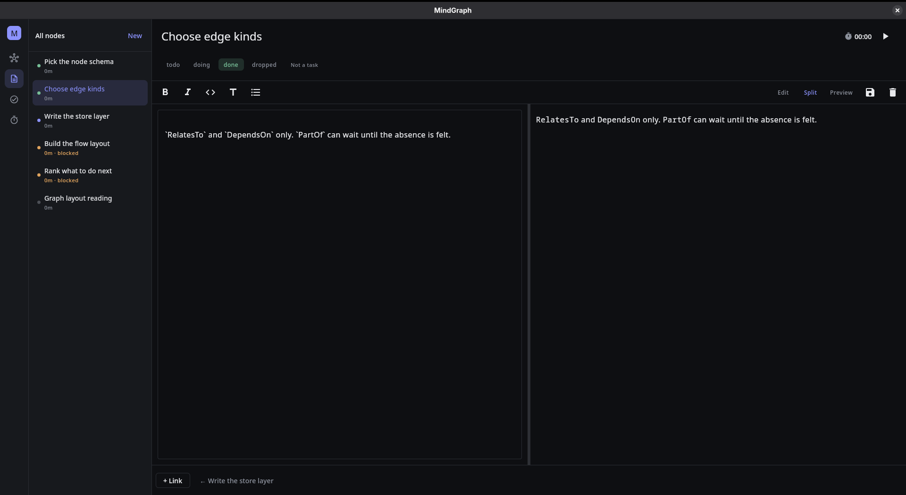

# MindGraph

MindGraph is a second brain built on a graph. Notes, tasks, and tracked time are the
same kind of thing — a **node** — so a thought can become work without becoming a
second record, and the dependencies between them form a graph you can actually read.

Your vault is a folder of markdown files. Nothing is locked in a database.

It is built with Kotlin and Compose Multiplatform for Desktop, in `desktop/`.


## The idea

Most tools make you choose. A note-taking app gives you linked thoughts but no sense
of what to do next; a task manager gives you a checklist but nowhere to think. Keeping
both means keeping them in sync forever.

MindGraph has one entity. Every node is a markdown document, and a node is *also* a
task when it has a status. Writing up a problem and tracking the work on it happen in
the same file.

## What you get

**One graph, two ways to read it.** Mind mode is force-directed, for associative
thinking. Flow mode lays dependencies out in ranked columns, because springs scramble
exactly the ordering a dependency graph exists to show.


**Status you don't have to maintain.** A task whose dependencies are unfinished is
blocked — computed by walking the graph, never typed in. Finish the thing upstream and
what it was holding up becomes ready on its own. Cycles are refused when you create
them, not discovered later.

**A task list that has an opinion.** Tasks are grouped by what the graph says you can
do, and ready work is ordered by how much finishing it unblocks.


**Notes and tasks edited the same way.** Title, markdown body, live preview, and the
task controls in the header — "Make this a task" is a button, not a different screen.
Type `[[a note title]]` in the body and it becomes a link.



**Time tracked per node.** Start a timer on anything. Node size on the graph encodes
cumulative tracked time, so the picture of your vault doubles as a picture of where
your time went.

## Your data

A vault is a directory of markdown. One file per node, and the frontmatter fully
describes it:

```markdown
---
id: 01M0V4BQMAJ000RTB5PNFK2P5N
title: Write the store layer
status: doing
depends_on: [01M0V4BNNTVG12ZJ9QHSZG0BTB]
created: 2026-08-24T21:00:00Z
updated: 2026-08-24T21:00:00Z
---

Markdown is the truth. See [[Pick the node schema]] for why.
```

This has consequences worth knowing:

- **Edit in any editor.** Files you hand-write load exactly like files the app wrote.
- **Fields you add are kept.** Unknown frontmatter keys survive round trips.
- **Rename freely.** The `id` is a ULID and never changes, so renaming a file or a
  title never breaks a link.
- **Version it.** A vault is plain text, so `git init` in it works.
- **Delete a link, delete the edge.** `[[wikilinks]]` are read from the body every
  load and never copied into frontmatter, so nothing is left stranded.

Tracked time lives in `.mindgraph/sessions.jsonl` as an append-only log, kept out of
the markdown so stopping a timer doesn't rewrite a note.

### Layout

```
~/.config/mindgraph/vault/
├── nodes/                # one .md per node — this is your content
└── .mindgraph/
    └── sessions.jsonl    # append-only tracked time
```

Set `MINDGRAPH_HOME` to put the vault somewhere else. If `HOME` is unavailable,
MindGraph falls back to `./.mindgraph-vault/`.

## Getting started

```bash
cd desktop
./gradlew run
```

The vault directory is created on first launch. There is no import step: drop markdown
files into `nodes/` and they show up, as long as each carries a unique ULID `id` in its
frontmatter. Files without one are skipped rather than rewritten, so an unrelated
markdown file sitting in the folder is left alone.

## Useful commands

```bash
make run
make test
make build
```

Or from `desktop/` directly: `./gradlew run`, `./gradlew test`, `./gradlew build`.

## Project layout

- `model/` — `Node`, its optional `TaskFacet`, and projected `Edge`s
- `storage/` — the markdown vault: frontmatter parsing, the node store, the session log
- `state/` — `AppViewModel` (the single source of UI state), the graph layout engine,
  and `TaskGraph`, which derives blocked/ready state from dependency edges
- `ui/` — the nav rail and the Graph, Notes, Tasks, and Work destinations

All under `desktop/src/main/kotlin/dev/mindgraph/`.

## Documentation

- [AGENTS.md](AGENTS.md) contributor guide and repository conventions
- [HOW_TO_CONTRIBUTE.md](HOW_TO_CONTRIBUTE.md) contributor workflow
- [ROADMAP.md](ROADMAP.md) product direction and upcoming work
- [BENCHMARK.md](BENCHMARK.md) benchmark notes and methodology

## Where this is going

The graph is meant to become the unifying surface over every kind of entity, not a
visualization bolted onto notes. Next up: ranking what to work on by critical path,
and an AI layer that reads the derived graph rather than the raw files.
