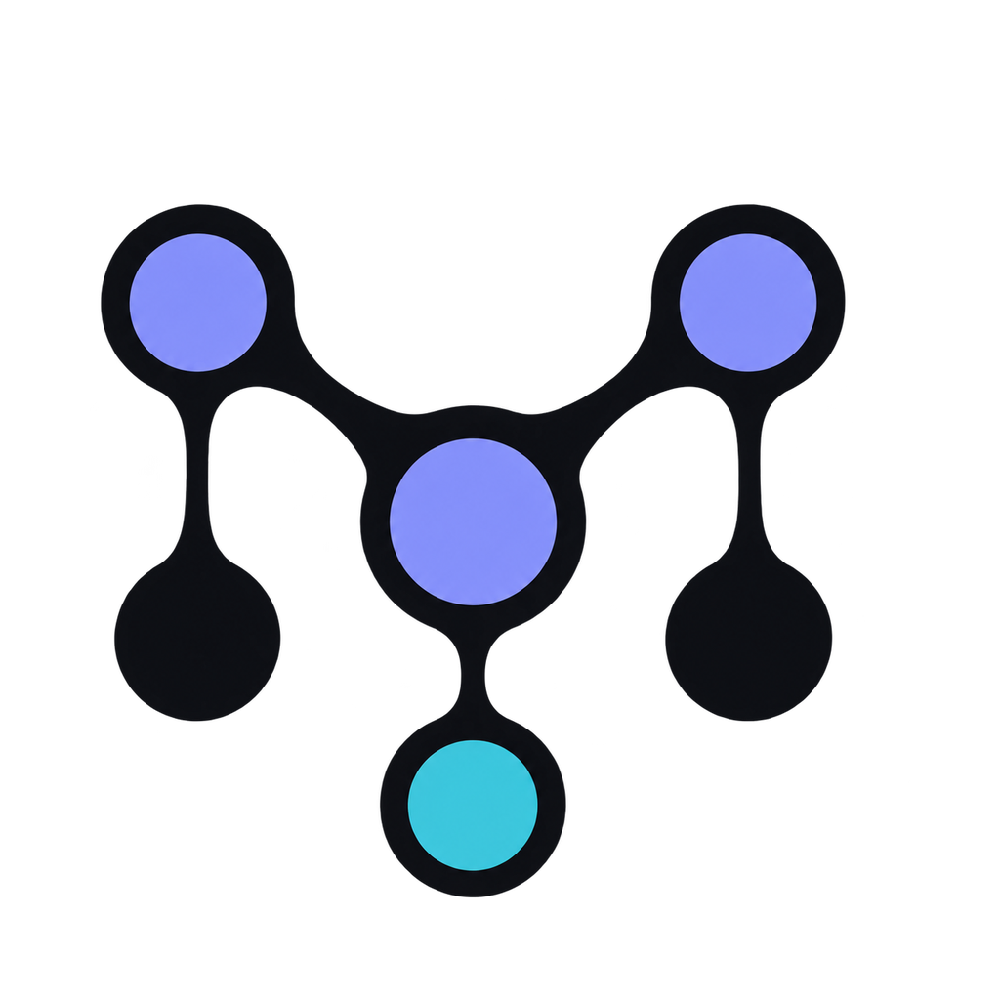
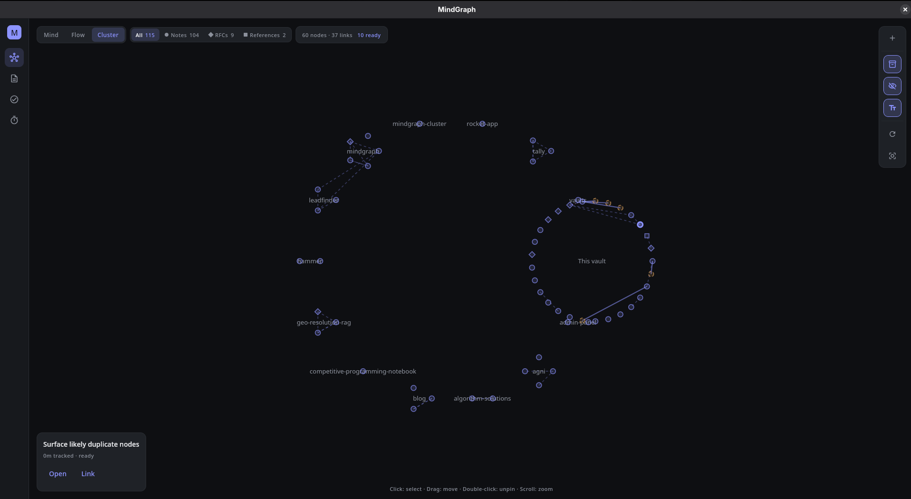
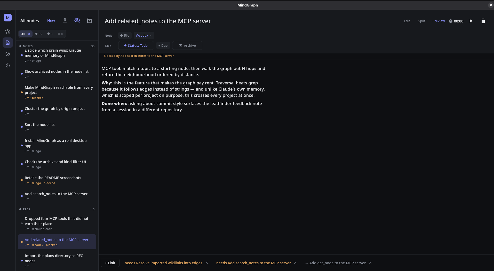
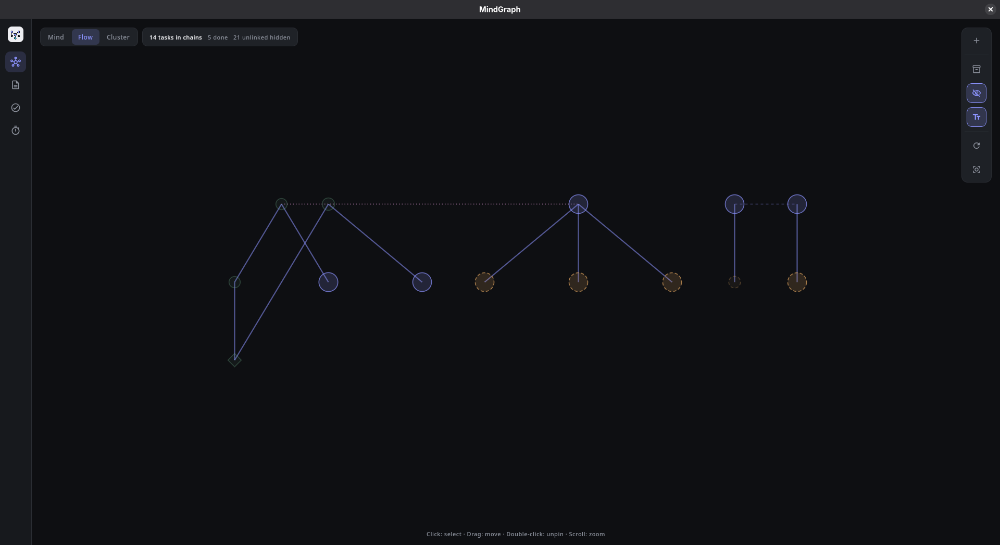
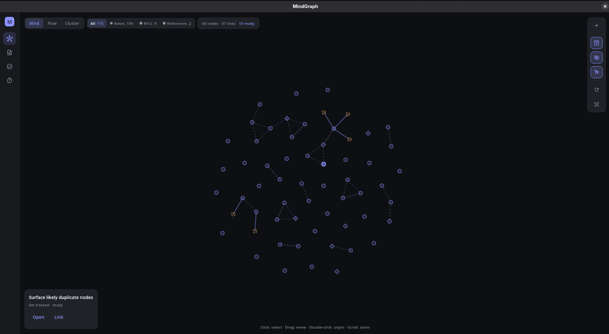
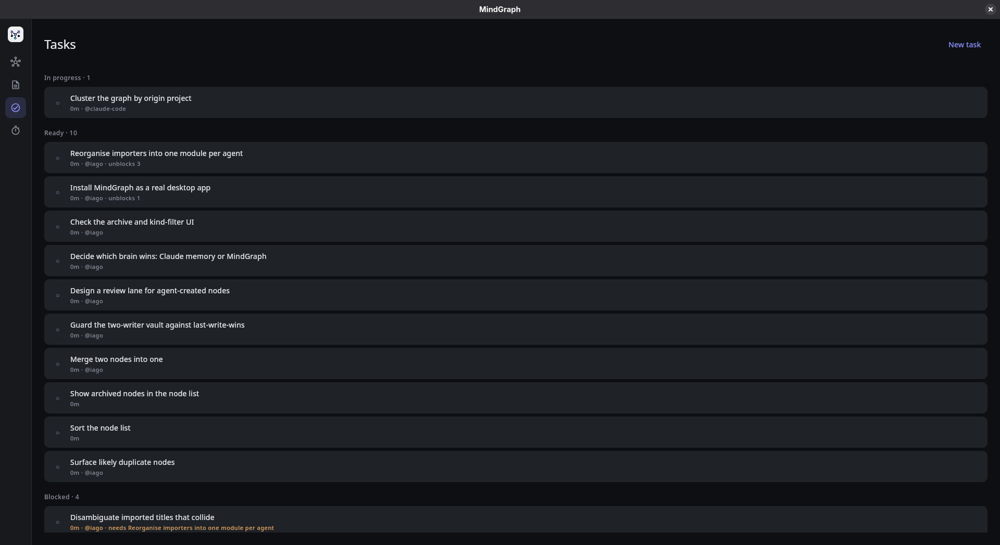
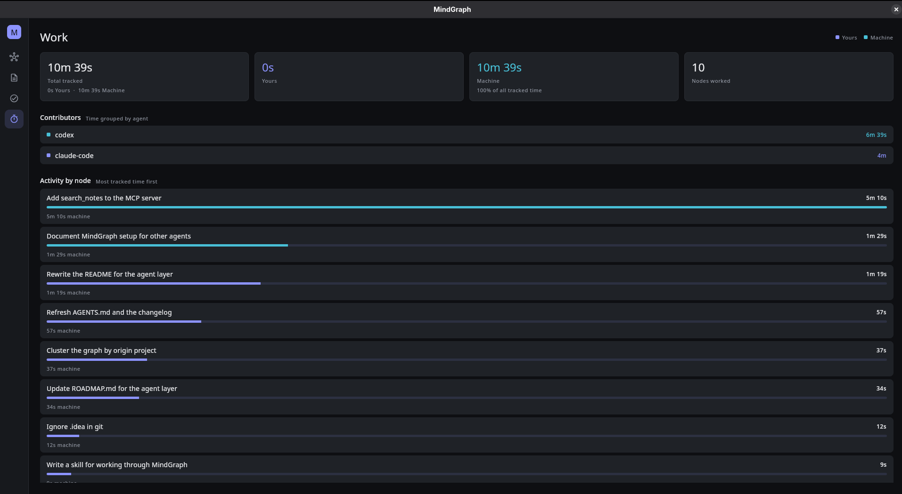

<p align="center">
  
</p>

<h1 align="center">MindGraph</h1>

<p align="center">
  <b>A context layer for coding agents, in the shape of a graph you can read.</b>
</p>

[](LICENSE)
[](https://kotlinlang.org)
[](https://www.jetbrains.com/compose-multiplatform/)
[](#agents-work-the-graph)
[](#getting-started)

Coding agents forget between sessions. What they do remember is siloed per project and
flat — a folder of notes with no ordering, no dependencies, and no way to ask which of
them matter for the work in front of you. So each session re-derives the same context,
and decisions you already made get quietly re-litigated.

MindGraph makes that context a graph. Every node is a markdown document — a note, an
**RFC**, or a reference — and a node is *also* a task when it has a status. Edges record
what depends on what, and what is *context for* what. The running app hosts an MCP server,
so agents work that graph directly: ask what is ready, load the context for it as a single
budgeted document, do the work, close it out. Time they spend is logged as theirs, next to
yours.

It also imports the memory your agents already write. Claude Code keeps notes per project
and structurally cannot read across them; MindGraph pulls every project's into one graph,
with the links between them resolved.

Your vault is a folder of markdown files. Nothing is locked in a database, and you curate
it in a real app rather than by hand-editing what an agent left behind.

Built with Kotlin and Compose Multiplatform for Desktop, in `desktop/`.



<sub>Cluster mode: one vault, grouped by the repository each note came from. A dozen projects that could never
read each other, and "This vault" for the work done here.</sub>

## The idea

A context window is finite, so the useful question is never "what do you know" but
"what should you load for *this*". A flat folder of notes cannot answer that. A graph
can: the neighbourhood around a piece of work is a traversal, and what blocks it is an
edge you already drew.

That is why MindGraph has one entity rather than two. Every node is a markdown document,
and a node is *also* a task when it has a status — so the design you wrote and the work
it governs are the same object, and an agent that reads one has found the other.

There is one thing to read, one thing to write, and the ordering between them is derived
rather than declared. An agent cannot put the plan out of step with itself, because it
was never given a second copy of it.

## Agents work the graph

The MCP server runs inside the app, on loopback, for as long as the window is open.
That is deliberate: an agent's change lands on the graph you are looking at, not just
in a file you will notice later.

| Tool | What it is for |
| --- | --- |
| `list_ready_tasks` | What can actually be started now, ranked. The question to ask first |
| `search_notes` | Find nodes by title, alias, or body text, with a context snippet |
| `related_notes` | The context for a piece of work, as one document cut to a token budget |
| `get_node` | Read one node in full when a ready-task summary is not enough |
| `create_task` | Capture, with an optional deadline |
| `create_note` | Capture what is *not* work — a note, RFC or reference, with no status |
| `append_node_body` | Add to the end of a node. Only ever adds |
| `link_nodes` | `depends_on`, `relates_to`, or `context_for`. Cycles are refused |
| `update_status` | `todo` / `doing` / `done` / `dropped`, and what the change unblocked |

Nine tools, kept deliberately few: every schema is sent on every request of every
session, so the surface is the loop — orient, load context, capture, structure, close —
and nothing else. Destructive and fiddly operations stay in the app, where you can see
what you are doing.

Point a client at it while the app is running:

```bash
claude mcp add --scope user --transport http mindgraph http://127.0.0.1:4319/mcp
codex mcp add mindgraph --url http://127.0.0.1:4319/mcp
```

`--scope user` is the part that matters. Registered per project, the graph is reachable only
from the repository it was registered in — which is the silo MindGraph exists to remove. At user
scope an agent working in any repository can read the whole vault and record what it did.

Other agents should configure a Streamable HTTP MCP server named `mindgraph` with the
same URL. The server is loopback-only by default, so agents on another machine need an
SSH tunnel or another deliberately secured transport rather than opening the port.

Set `MINDGRAPH_MCP_PORT` to move it. If the port is busy the app says so and starts
anyway — MindGraph without MCP is still MindGraph.

Agents working on this repository should also load the workflow skill at
`.claude/skills/mindgraph-workflow/SKILL.md`. The file is plain Markdown, so agents
without Claude-style skills can treat it as their system or project instructions. Its
important rule is simple: ask `list_ready_tasks`, create or find the work node, mark it
`doing` with `update_status`, then close it when the work is finished.

**Machine labour.** Moving a task to `doing` starts the clock and closing it stops the
clock, so elapsed time is a consequence of the work being tracked rather than a second
thing to remember. Where the change came from decides who is credited: the same status
set in the window is your work, set over MCP it is the machine's. Nothing is declared,
so the split cannot drift from the truth. An agent can name itself, and the Work screen
totals it by name.

## Building the context an agent loads

A context window is finite, so the interesting problem is not storing everything — it is
choosing what to hand over. MindGraph has both halves of that.

**Curate it.** `context_for` is a third kind of edge, next to `depends_on` and
`relates_to`. It means *load this when working on that*. It is deliberately not
association: "these two ideas are related" is not "read this first", and reusing
`relates_to` would sweep every incidental link into the briefing. A project is just a
node, so starting one means creating it and linking in the pieces that matter. The edge
lives on the note that *is* the context, so one note can brief several projects without
being copied, and a note carried out of the vault still says what it was for.

**Load it.** `related_notes` takes a topic, finds the starting node, walks the graph
outward, and returns the neighbourhood as **one markdown document** — nearest first, a
curated edge outranking an inferred one at the same distance, cut to a token budget, with
whatever did not fit listed at the end rather than silently dropped.

```
related_notes(topic: "rewrite the importer", budget_tokens: 2000)
```

```markdown
# Context for: Reorganise importers into one module per agent
...
## Duplicate nodes are mostly import bugs, not merge candidates
id: 01M1J8FJMF98BXHPJPM8BQYDTR · kind: rfc · chosen as context · 1 hop
...
---
## Not included (3)
Reached by the walk but left out for want of budget.
```

Two properties matter more than they sound. Edges are walked in **both directions**, so
a note filed as context for your work is found from the work — the curated case is
entirely incoming. And the result carries the **bodies** of what it names, not the
titles: a title is a second lookup, and the test this is built against is handing the
document to an agent with no memory and expecting it to start.

That last part is borrowed. The idea of deliberately testing your documentation against
a blank session comes from Dave Rensin's
[Elephants, Goldfish and the New Golden Age of Software Engineering](https://medium.com/@drensin/elephants-goldfish-and-the-new-golden-age-of-software-engineering-c33641a48874).

## RFCs that agents actually read

An RFC is a node kind, not a folder convention. Write the design in the app — title,
markdown body, live preview — mark it `rfc`, and link it to the work it governs with
`link_nodes`.

What that buys you is the retrieval path. An agent picking up a task calls `get_node`
and gets the reasoning in full, not a one-line summary: the decision, why it was made,
and what was rejected. The context that would otherwise be re-derived from scratch — or
guessed at — is one hop away from the thing being worked on.

It works in the other direction too. Agents are append-only by design: they may create a
note beside your RFC and add to the end of a node, but they cannot rewrite your title,
body, deadline or assignee. New context arrives as another node with an edge, so the
record of what you decided stays yours and stays legible.

Both `[[wikilinks]]` in the prose and explicit edges count, so linking while writing costs
two brackets.



<sub>An RFC node: the reasoning in the body, the agent it belongs to, what it is blocked by, and
the edges to the work it governs — all of it reachable from one `get_node` call.</sub>

## What you get

**One graph, three ways to read it.** Mind mode is force-directed, for associative
thinking. Flow mode draws the dependency trees among your tasks — prerequisites above
the work waiting on them — because springs scramble exactly the ordering a dependency
graph exists to show. Cluster mode groups by the repository a note came from, which is
the axis that makes a cross-project vault legible.

Flow shows only tasks that are actually part of a chain, and says how many it left out.
A vault has far more loose tasks than linked ones, and a layout that gives every
unconnected node its own column is a single row thousands of pixels wide with the real
structure lost inside it. Finished tasks in the middle of a chain stay as faded ghosts
when done work is hidden, so a live task keeps the visible reason it sits where it does.



<sub>The tasks that have an order, drawn as trees. Unlinked tasks are counted on the pill rather than
scattered across the canvas, the faded nodes are finished prerequisites holding their chains
together, and the dotted line is a `context_for` edge.</sub>



<sub>Mind mode with labels on. Shape is kind, colour is task state, size is tracked time — and the
control rail can turn the text off when the shape is what you want to read.</sub>

**Kinds you can see at a glance.** A node is a note, an RFC, or a reference — drawn as
a circle, a diamond, or a square. Shape rather than colour, because colour already
means task state and size already means tracked time. Filter the canvas to one kind
without moving anything: hiding the rest answers the same question as clustering, and
leaves the surviving edges meaning what they meant.

**Status you don't have to maintain.** A task whose dependencies are unfinished is
blocked — computed by walking the graph, never typed in. Finish the thing upstream and
what it was holding up becomes ready on its own. Cycles are refused when you create
them, not discovered later.

**A task list that has an opinion.** Ready work is ordered overdue first, then by how
much finishing it unblocks. There is no priority field: a declared rank would
contradict the derived one, and it inflates until everything is urgent. A deadline
decays on its own, because time moves.



<sub>Nothing here was typed in: ready, blocked, and what each one is waiting on are read off the graph.</sub>

**Notes and tasks edited the same way.** Title, markdown body, live preview, and the
task controls in the header — "Make this a task" is a button, not a different screen.
Type `[[a note title]]` in the body and it becomes a link.

**Your coding agent's memory and plans, in the same graph.** Claude Code writes notes per
project — markdown, frontmatter, `[[wikilinks]]`, one fact per file — and seals each set in
its own directory, so nothing can read them together. Its plan documents are RFCs already,
context and decision and rationale, just without the label. One button imports both, links
and all: notes as notes, plans as `rfc` nodes tied to the project they name. Re-running only
brings in what is new, and it is read-only upstream — your `~/.claude` is never written to.

A plan is linked by what its *title* names, not what its body mentions. A design document
that references another repository in passing is not about that repository, and an edge
that says otherwise is worse than no edge at all.

**Archive instead of deleting.** A node can be put away and keep its id, its links and
its tracked time. Archiving is not a fifth status, because that would overwrite whether
the work was *done* or *dropped* — and archived work stops blocking whatever depended
on it, so tidying up never strands the tasks behind it.

**Time tracked per node — and whose time it was.** Start a timer on anything. Node size
on the graph encodes cumulative tracked time, so the picture of your vault doubles as a
picture of where your time went. The log records who spent it, so the Work screen can
say how much of a body of work a machine did, and which agent did it.



<sub>A session where every minute was machine labour, split between two agents by name.</sub>

## Your data

A vault is a directory of markdown. One file per node, and the frontmatter fully
describes it:

```markdown
---
id: 01M0V4BQMAJ000RTB5PNFK2P5N
title: Write the store layer
kind: note
status: doing
due: 2026-09-04
depends_on: [01M0V4BNNTVG12ZJ9QHSZG0BTB]
context_for: [01M0V4BPQ7X1KM4ZE8TCJ2WR9D]
created: 2026-08-24T21:00:00Z
updated: 2026-08-24T21:00:00Z
---

Markdown is the truth. See [[Pick the node schema]] for why.
```

This has consequences worth knowing:

- **Edit in any editor.** Files you hand-write load exactly like files the app wrote.
- **Changes appear as you make them.** The vault is watched, so an edit from another
  editor, an agent in another process, or a `git checkout` lands on the graph without a
  reload.
- **Fields you add are kept.** Unknown frontmatter keys survive round trips.
- **Rename freely.** The `id` is a ULID and never changes, so renaming a file or a
  title never breaks a link.
- **Version it.** A vault is plain text, so `git init` in it works.
- **Link by any name it answers to.** A node is found by its title, its filename slug, or
  any `aliases:` you give it — which is how an imported note keeps working when its title
  is a whole sentence and its siblings link it by a short slug.
- **Delete a link, delete the edge.** `[[wikilinks]]` are read from the body every
  load and never copied into frontmatter, so nothing is left stranded.
- **A typo costs a label, not a document.** An unreadable `kind` reads as a note, an
  unreadable `due` as no deadline. Neither drops the file.

Tracked time lives in `.mindgraph/sessions.jsonl` as an append-only log, kept out of
the markdown so stopping a timer doesn't rewrite a note:

```json
{"node_id":"01M0V4BQMAJ000RTB5PNFK2P5N","started_at":1788307701,"stopped_at":1788309201,"seconds":1500,"worker":"agent","agent":"claude-code"}
```

Lines written before the log recorded a worker read as your own work, which is what
they were.

### Layout

```
~/.config/mindgraph/vault/
├── nodes/                # one .md per node — this is your content
└── .mindgraph/
    └── sessions.jsonl    # append-only tracked time, per worker
```

Set `MINDGRAPH_HOME` to put the vault somewhere else. If `HOME` is unavailable,
MindGraph falls back to `./.mindgraph-vault/`.

## Getting started

```bash
cd desktop
./gradlew run
```

The vault directory is created on first launch. There is no import step for your own
markdown: drop files into `nodes/` and they show up, as long as each carries a unique ULID
`id` in its frontmatter. Files without one are skipped rather than rewritten, so an
unrelated markdown file sitting in the folder is left alone.

If you use Claude Code, the import button on the node list pulls in
`~/.claude/projects/*/memory/*.md` — every project's memory notes as one graph, with the
links between them resolved. It is safe to press again as those notes accumulate.

The adjacent Codex import button pulls in repository instructions from nested `AGENTS.md`
files under `CODEX_WORKSPACE_ROOT` (defaulting to `~/workspace`). These files are copied as
read-only context notes, and repeated imports skip paths already present in the vault.

## Useful commands

```bash
make run
make test
make build
```

Or from `desktop/` directly: `./gradlew run`, `./gradlew test`, `./gradlew build`.

## Project layout

- `model/` — `Node`, its `NodeKind` and optional `TaskFacet`, projected `Edge`s, and
  the `WorkSession` that records who spent the time
- `storage/` — the markdown vault: frontmatter parsing, the node store, the session log
- `state/` — `AppViewModel` (the single source of UI state), the graph layout engine,
  `TaskGraph`, which derives blocked/ready state and ranks what to do next, `Retrieval`,
  which assembles a context bundle and cuts it to a budget, `FlowForest`, which lays out
  the dependency trees, and the linking, filtering and work-summary rules the UI and the
  tools share
- `mcp/` — the MCP protocol, its loopback HTTP transport, and the tools agents call
- `ui/` — the nav rail and the Graph, Notes, Tasks, and Work destinations

All under `desktop/src/main/kotlin/dev/mindgraph/`.

Rules that both the app and the agents must obey live in `state/`, not in either
caller — so an agent cannot build a graph the app would have refused.

## Documentation

- [AGENTS.md](AGENTS.md) contributor guide and repository conventions
- [HOW_TO_CONTRIBUTE.md](HOW_TO_CONTRIBUTE.md) contributor workflow
- [ROADMAP.md](ROADMAP.md) product direction and upcoming work
- [BENCHMARK.md](BENCHMARK.md) benchmark notes and methodology

## License

[MIT](LICENSE).

## Where this is going

The graph is meant to be the context substrate an agent works from, not a visualization
bolted onto notes. The agent layer is no longer the plan — it is the current work.

Retrieval has landed, which was the part that had to work for any of the rest to matter.
`search_notes` finds a foothold by text; `related_notes` walks the edges outward and hands
back the neighbourhood as one budgeted document, across every project at once. That is the
thing per-project memory structurally cannot do.

What is not solved yet is knowing whether a bundle is any *good*. A curated context set
that is missing something looks exactly like a complete one until an agent fails on it, and
nothing in the app can tell you which you have. Making that visible — rather than adding
more ways to put notes in — is the next thing worth doing.

After that: merging genuine duplicate nodes, importers reorganised so a new agent's memory
format is one file rather than a fourth copy of the same orchestration, and packaging so
the app outlives the terminal that launched it.
