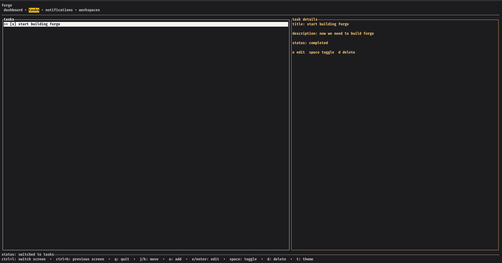

# Forge

Forge is a terminal-native productivity environment for software engineers, built in Rust with Ratatui, Crossterm, Tokio, and SQLite via SQLx.

## Preview



## Features

- Dashboard, tasks, notifications, and workspaces screens
- Keyboard navigation for fast terminal use
- Persistent tasks stored in SQLite
- Theme switching
- Clean architecture with separate app, UI, services, storage, and plugins layers

## Quick Start

```bash
cargo run
```

By default, Forge stores its SQLite database in a temp directory. Set `FORGE_DB_PATH` to use a custom file:

```bash
FORGE_DB_PATH=./forge.db cargo run
```

See [HOW_TO_CONTRIBUTE.md](HOW_TO_CONTRIBUTE.md) for development commands, key bindings, testing, and repository conventions.
